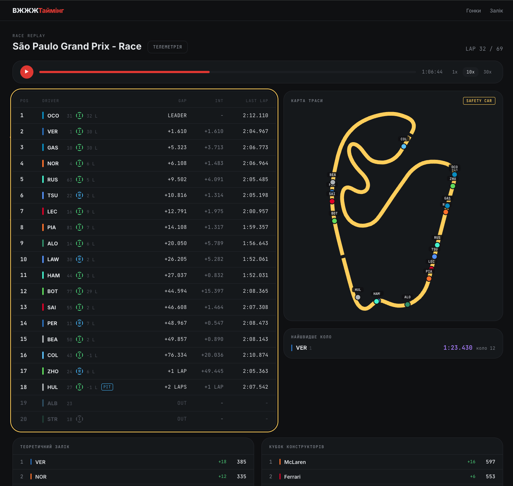
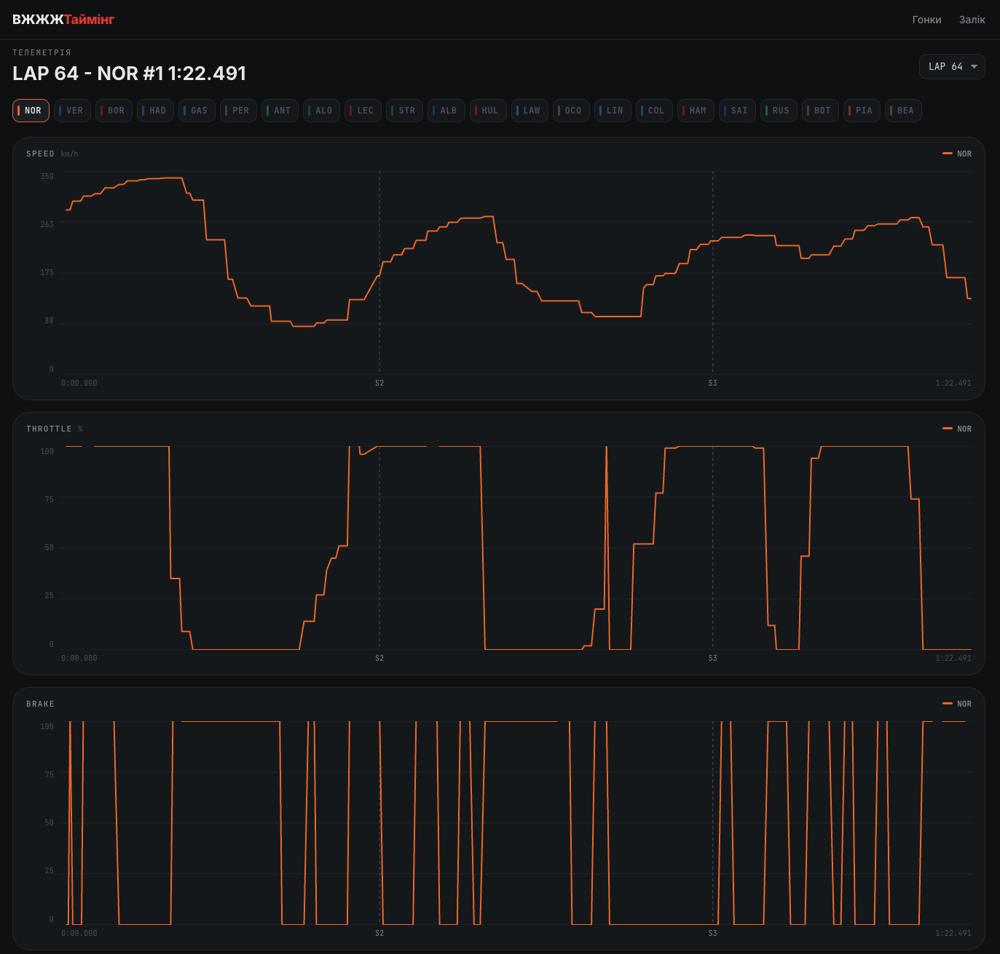
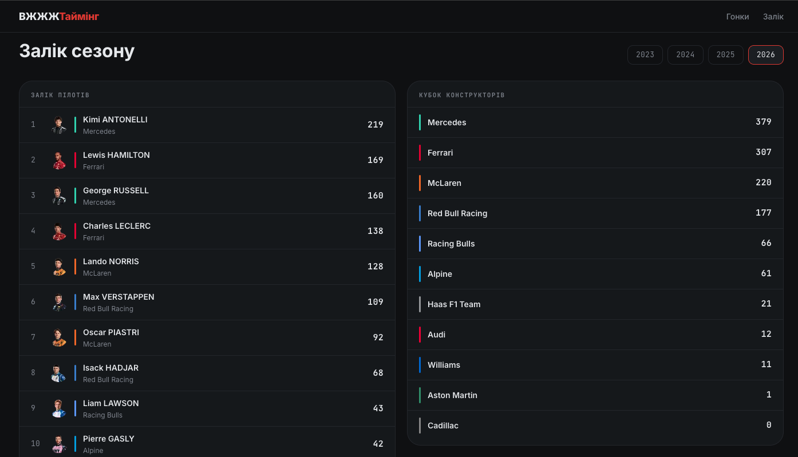

# ВЖЖЖТаймінг · WhooshTiming

Replay any Formula 1 session with a broadcast-style live timing screen — running order, gaps,
lap times, tyres, flags, a live track map, championship standings that update as the race
unfolds, and lap-by-lap telemetry.

Everything is reconstructed from the public [OpenF1](https://openf1.org) API: no live feed, no
recorded video — just raw timing data replayed on a cursor.

> UI copy is Ukrainian; broadcast terms (PIT, OUT, LEADER, SAFETY CAR) stay English by convention,
> the way they appear on a real timing screen.



## Features

**Calendar** — season picker, races marked as completed, upcoming or cancelled.

**Race replay** (`/races/[slug]`)
- Playback controls: play/pause, 1× / 10× / 30×, click-drag scrubbing and keyboard seeking
- Live timing table — position, gap, interval, last lap with personal-best / session-best
  colouring, tyre compound and age, pit indicator, retired drivers dimmed and sorted out
- Track status — yellow / safety car / VSC / red / chequered, driven by a state machine over race
  control messages; the timing frame and the track outline recolour together
- Track map — circuit outline traced from real car coordinates, sector cuts, cars moving in real
  time with interpolated positions
- Theoretical championship — standings recalculated for the current cursor position
- Fastest lap panel — who holds it *right now*, not at the end of the race

**Telemetry** (`/races/[slug]/telemetry`)
- Compare any number of drivers on the same lap
- Speed, throttle and brake traces with a shared hover crosshair and sector markers
- Charts drawn from scratch in SVG — no charting library



**Standings** (`/standings`) — full drivers' and constructors' tables for any season.



## Stack

- **Next.js 16** (App Router) · **React 19** · **TypeScript** (strict)
- **TanStack Query v5** — client data layer, persisted to **IndexedDB** so repeat visits hit no
  network at all
- **Zustand** — replay engine state
- **CSS Modules** with a design-token system — no utility framework
- **Vitest** — 82 tests over the replay engine, geometry and chart maths

## Running locally

```bash
npm install
npm run dev
```

Open <http://localhost:3000>. No API key or `.env` needed — OpenF1's free tier is public.

```bash
npm run build     # production build
npm run lint
npx vitest run    # tests (also enforced by a pre-commit hook)
```

## How it works

The design constraint that shapes everything: **the UI never knows whether it is replaying a
recording or following a live session.**

Session data is fetched once and treated as immutable. A single store holds a `cursor` — the
current moment in the race — and one `requestAnimationFrame` loop advances it by elapsed time ×
playback speed. Every panel then asks the same question: *what was true at this instant?*

Answering that fast enough for 60 fps is the interesting part:

- Raw event streams are pre-indexed once per session into per-driver sorted arrays; each frame
  does a **binary search**, never a scan.
- Cursor subscriptions are pushed down to the smallest component that needs them, so a moving
  cursor never re-renders the page.
- Car positions are **interpolated** between the 3.7 Hz samples, so motion stays smooth at 1×.
- Location data (~0.5M records per race) is loaded **lazily in time windows** around the cursor,
  debounced so that scrubbing does not fire a request per window.
- All requests pass through a **promise-chain queue** that paces them under OpenF1's rate limit.

Pure logic lives in `src/lib/` with no React imports — which is why the engine, the geometry and
the chart maths are all unit-tested.

## Data source and limits

OpenF1's free tier serves **historical sessions only**, available roughly 30 minutes after a
session ends, at 3 requests/second and 30 per minute. Live timing would need their paid tier —
the architecture is deliberately ready for it: only the data source would change.

Data quality varies by session; where the feed is too coarse to draw a circuit, the map says so
instead of drawing nonsense.

## Status

A learning project, built to explore real-time data flow, TypeScript generics, rendering
performance and Next.js rendering strategies. Feature-complete against its original roadmap and
still being extended.

Not affiliated with Formula 1. Team names and driver photographs belong to their respective
owners.
